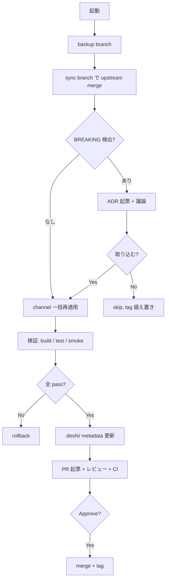

# isbtty/nanoclaw 詳細設計

このドキュメントは [overview.md](overview.md) で示した全体像の **詳細** を記す。命名規則・ディレクトリ配置・barrel 衝突対策・スキーマ・追従フローの順に説明する。

## 1. Skill 命名規則

詳細は ADR-0001。

| 種別 | パターン | 例 |
|------|---------|-----|
| 動詞系 | `^deshi-(add\|init\|update\|migrate\|setup\|run\|manage\|convert)-[a-z0-9-]+$` | `deshi-add-line`, `deshi-update-from-upstream` |
| Utility (非動詞) | `^deshi-[a-z0-9-]+$` | `deshi-feedback-gh` |

**動詞 prefix の使い分け** (8種に限定):

- `add-` 機能追加
- `init-` 初期化 (冪等)
- `setup-` 複数 init を束ねる全体フロー
- `update-` 既存を最新化
- `migrate-` 一回限りのスキーマ変換
- `manage-` 対話 UI
- `run-` 定期タスク実行
- `convert-` 形式変換

## 2. ディレクトリ配置

詳細は ADR-0002。

```
isbtty/nanoclaw/
├── .claude/skills/                    ← upstream + deshi Skill が並ぶ
├── src/deshi/                         ← deshi 専有 namespace
│   ├── index.ts                       ← root barrel
│   ├── channels/index.ts              ← deshi channels barrel
│   ├── providers/index.ts             ← deshi providers barrel
│   └── lib/                           ← (必要に応じて)
├── container/skills/
│   ├── welcome/                       ← Tier A
│   └── deshi-*/                       ← Tier B (prefix 必須)
└── .deshi/                            ← メタディレクトリ
```

deshi 固有コードは **`src/deshi/**` および `container/skills/deshi-*` に必ず閉じる** (ADR-0002)。upstream 管理ファイルへの侵入は barrel エントリの単一行のみに局所化する (ADR-0005)。

## 3. barrel 衝突対策

詳細は ADR-0005。

upstream の barrel ファイル (`src/channels/index.ts`、`src/providers/index.ts`) には `import './deshi.js';` の単一行のみを追加する。

```typescript
// src/channels/index.ts (upstream 管理)
import './cli.js';
import './slack.js';
import './deshi.js';           // deshi の唯一のエントリ

// src/channels/deshi.ts (deshi 管理、1行)
import '../deshi/channels/index.js';

// src/deshi/channels/index.ts (deshi 管理、自由に追記)
import './line.js';
```

衝突しうる行は `src/channels/index.ts`、`src/providers/index.ts` の各1行のみ。これに対して以下を適用する:

- `.gitattributes` で対象ファイルに `merge=deshi-barrel` を指定
- `.deshi/scripts/merge-barrel.sh` を custom merge driver として登録

merge driver は union merge (両側の import 行を全て残し、重複排除する) を実行する。

## 4. バージョニング戦略

詳細は ADR-0006。

| Tier | pin 対象 | 記録場所 |
|------|---------|---------|
| A | upstream main / channels の SHA | `.deshi/upstream-versions.json` |
| B | semver + monorepo tag (`v0.X.Y`) | `.deshi/skills-catalog.json` |

## 5. メタファイルのスキーマ

### `.deshi/upstream-versions.json` (Tier A pin)

```json
{
  "schemaVersion": 1,
  "upstream": {
    "repo": "nanocoai/nanoclaw",
    "main": {
      "tag": null,
      "sha": "<merge-base SHA>",
      "lastSyncedAt": "2026-05-12T10:00:00+09:00",
      "lastSyncedBy": "han2210mh@gmail.com",
      "policy": "merge-base"
    },
    "channels": {
      "sha": "<channels HEAD SHA>",
      "lastSyncedAt": "2026-05-12T10:00:00+09:00",
      "installed": [
        "slack", "discord", "telegram", "whatsapp",
        "imessage", "matrix", "webex", "teams", "linear",
        "github", "gchat", "wechat", "whatsapp-cloud", "resend"
      ]
    }
  },
  "provider": { "fixed": "claude" },
  "deshi": { "currentTag": "v0.1.0", "currentCommit": "..." }
}
```

**フィールドの意味**:
- `upstream.main` — upstream `main` branch の追従状態 (`/deshi-update-from-upstream` が更新)
- `upstream.main.policy` — `merge-base` (ADR-0008 既定) または `target` (`--target` 明示指定時)
- `upstream.channels.sha` — upstream `channels` branch HEAD の SHA (複数 channel まとめて単一 SHA で pin)
- `upstream.channels.installed` — **deshi が明示的に取り込んでいる channel のリスト**。このリストにあるものだけが `install-official-channels.sh` で取り込まれる
- `provider.fixed` — `claude` 固定 (Tier A の providers branch は追従しない)
- `deshi.currentTag` / `currentCommit` — deshi 側の最新リリース情報

**`installed` 配列の意図**: 自動検出だと upstream に追加された channel が無告知で取り込まれ、設定不備のまま動く / 攻撃面が増えるリスクがある。明示リストにすることで deshi メンバーが意図的に追加判断する運用に倒し、信頼性を取った。

### `.deshi/skills-catalog.json` (deshi 管理 Skill のカタログ)

```json
{
  "schemaVersion": 1,
  "deshiRelease": "v0.1.0-initial",
  "skills": [
    {
      "name": "deshi-update-from-upstream",
      "kind": "operational",
      "version": "0.1.0",
      "owner": "@isbtty/deshi-core",
      "sources": [".claude/skills/deshi-update-from-upstream/"],
      "introducedIn": "v0.1.0-initial"
    }
  ]
}
```

**カタログの意図**: 「deshi が乗せている Skill 全体」を辿る出発点をこの1ファイルに統一する。CI (`verify-layout.ts`, ADR-0007) はこのカタログと実ファイル配置の双方向整合をチェックする。

## 6. upstream 追従フロー

詳細は `.claude/skills/deshi-update-from-upstream/SKILL.md`。



## 7. 衝突解決ポリシー (upstream → deshi)

詳細は `.claude/skills/deshi-update-from-upstream/SKILL.md`。

| path | 方針 |
|------|------|
| `.deshi/**` | `--ours` (本 Skill が書く `.deshi/upstream-versions.json` と `.deshi/adr/**` を除く) |
| `src/deshi/**` | `--ours` |
| `CLAUDE.md`, `docs/**` | `--theirs` |
| `src/channels/<name>.ts`, `package.json` の `@chat-adapter/*` 行 | `--ours` (後で channel 再適用が上書き) |
| `src/channels/index.ts`, `src/providers/index.ts` | union merge |
| その他 (`src/router.ts` 等) | 自動解決せず、未解決のまま残す → 人間判断 |

## 8. 落とし穴 (初期セットアップ時)

- (A) pnpm `minimumReleaseAge: 4320` (3日) — 待つ / 旧 patch に落とす / exact version で exclude
- (B) `git show upstream/channels:...` で見つからない — dir 化等の構造変化を確認
- (C) container build cache — `docker buildx prune -af` で強制除去
- (D) `@chat-adapter/*` の peer dependency 衝突
- (E) `src/channels/index.ts` の import 順序

## 9. ロールバック手順

### `/deshi-update-from-upstream` のロールバック

backup branch + backup tag が必ず作成されるため:

```bash
git reset --hard deshi-backup-pre-upstream-<timestamp>
```

## 10. 検討経緯と未解決事項

### 設計判断の経緯 (主要なもののみ抜粋)

- (2026-04-27) JSON フィールドの命名整理。プロジェクト全体で TypeScript / JSON は camelCase 統一。
- (2026-04-27) `upstream-versions.json` の `channels` を「branch HEAD の単一 SHA + `installed` 配列」で管理する形に簡素化 (upstream/channels は単一ブランチで全 channel が同 commit に乗っているため)。
- (2026-04-28) 基準コミットを共通祖先運用に移行。`upstream/channels` が `upstream/main` の祖先関係を満たさず、ancestor チェックを通すために共通祖先まで戻す必要があった。詳細は isbtty/deshi#126。
- (2026-05-01) 共通祖先運用を Skill レベルで実装。`/deshi-update-from-upstream` の default 取り込み対象を `git merge-base upstream/main upstream/channels` に変更。詳細は ADR-0008 と isbtty/deshi#128。
- (2026-05-XX) 3 層 fork モデル (Tier C 顧客 fork) を廃止し、単一 fork (`isbtty/nanoclaw`) で運用する方針に。`dou-` 接頭辞を `deshi-` に変更。詳細は isbtty/deshi#189, isbtty/deshi#199。

### 未解決事項

1. `channels` branch 追従粒度 — 全ベンダリング前提。adapter 集合が増えたら submodule 等の再検討余地
2. container image のビルド方針 — 運用環境で rebuild するか、ghcr.io から配布か
3. deshi のバージョン採番 — upstream との対応 (`v0.X.Y+u2.0.14` の build metadata 表記など)
4. `verify-layout` の実装時期 — ADR-0007 で CI 必須化を決めたが、CI 自体がまだ未設定。それまでは PR レビューでの人間チェックに頼る。

## 関連ドキュメント

- 全体像: [overview.md](overview.md)
- ADR 一覧: [adr/](../adr/)
- 議論の経緯: isbtty/deshi#98, isbtty/deshi#189, isbtty/deshi#199
- Skill 仕様: `.claude/skills/deshi-update-from-upstream/SKILL.md` 他
